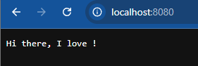

Step 2: Belajar webhost server sederhana

1. Buat file step2.go
```
//go:build ignore

package main

import (
	"fmt"
	"log"
	"net/http"
)

func handler(w http.ResponseWriter, r *http.Request) {
	fmt.Fprintf(w, "Hi there, I love %s!", r.URL.Path[1:])
}

func main() {
	http.HandleFunc("/", handler)
	log.Fatal(http.ListenAndServe(":8080", nil))
}

```

2. Compile and run di cmd windows
```
go build step2.go

step2
```
Atau langsung compile dan run
```
go run step2.go
```


3. Jika ada pop up windows `step2.exe`, klik allow

4. Buka url `https://http://localhost:8080/` pada browser


5. Tes dengan url di belakang dengan yang lain, contoh `https://http://localhost:8080/monkeys`

6. Liat hasilnya! Jika sudah selesai mencoba, maka Ctrl+c pada cmd tadi untuk close web server.