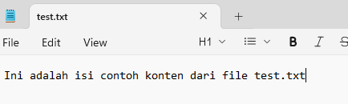

Step 3: Host web from txt file

1. Buat file step3.go dengan isi berikut
```
// Copyright 2010 The Go Authors. All rights reserved.
// Use of this source code is governed by a BSD-style
// license that can be found in the LICENSE file.

//go:build ignore

package main

import (
	"fmt"
	"log"
	"net/http"
	"os"
)

type Page struct {
	Title string
	Body  []byte
}

func (p *Page) save() error {
	filename := p.Title + ".txt"
	return os.WriteFile(filename, p.Body, 0600)
}

func loadPage(title string) (*Page, error) {
	filename := title + ".txt"
	body, err := os.ReadFile(filename)
	if err != nil {
		return nil, err
	}
	return &Page{Title: title, Body: body}, nil
}

func viewHandler(w http.ResponseWriter, r *http.Request) {
	title := r.URL.Path[len("/view/"):]
	p, _ := loadPage(title)
	fmt.Fprintf(w, "<h1>%s</h1><div>%s</div>", p.Title, p.Body)
}

func main() {
	http.HandleFunc("/view/", viewHandler)
	log.Fatal(http.ListenAndServe(":8080", nil))
}
```

2. Buat file test.txt dengan notepad di folder yang sama dengan step3.go dengan contoh isi




3. Compile dan run step3.go di cmd windows
```
go build step3.go

step3
```
atau run step3.go aja langung dengan
```
go run step3.go
```

4. Allow popup connection dari step3.exe dan buka url `http://localhost:8080/view/test`

5. Lihat hasilnya! Jika berhasil coba dengan buat file txt baru dan ganti url akhiran seperti `/test` ke nama file tsb