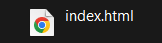
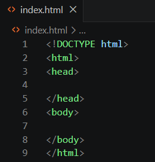
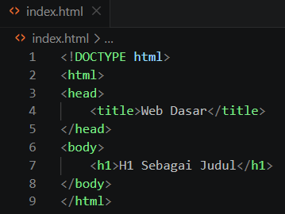
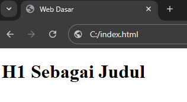
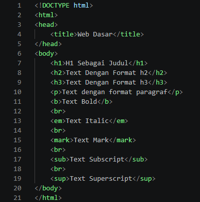

# Basic HTML-CSS

| Objectives | Key Result | Time Goal |
|---|---|---|
|[1) Memahami Dasar File HTML](#1-memahami-dasar-file-html) | 1.1) Memahami definisi HTML dan bagaimana HTML digunakan dalam menampilkan halaman web | 5 menit |
|  | 1.2) Membuat file index.html kosong dengan text editor | - |
|  |  1.3) Membuka file index.html di browser | - |
| [2) Memahami Struktur Dasar HTML](#2-memahami-struktur-dasar-html) | 2.1) Menulis struktur dasar pada index.html | 5 menit |
|  | 2.2) Menambahkan elemen dasar seperti title pada head dan juga heading pada body | 2 menit |
|  |  2.3) Mengecek validitas index.html di browser | - |
| [3) Menguasai Elemen Tag pada HTML](#3-menguasai-elemen-tag-pada-html) | 3.1) Menggunakan textual tags: `<h1> to <h6>, <p>, <b>/<strong>, ...` | 5 menit |
|  | 3.2) Menggunakan container tags: `<div> dan <span>` | 15 menit |
|  |  3.3) Menggunakan list tags: `<li>, <ul>, <ol>,...` | 10 menit |
|  |  3.4) Menggunakan table tags: `<table>, <caption>, <tr>,...` | 10 menit |
| [4) Menguasai Styling dan Interaksi Dasar pada HTML](#4-menguasai-styling-dan-interaksi-dasar-pada-html) |  4.1) Menggunakan dan memahami atribut dalam tags: `id, class, style` | 15 menit |
|  |  4.2) Menggunakan embedding dan link tags: ` dan <a href="..">` | 10 menit |
|  |  4.3) Menggunakan dan memahami inline CSS dasar | 25 menit |
|  |  4.4) Menggunakan form tags: `<form>, <button>, <input>, <textarea>, <select>` | 15 menit |
|  |  4.5) Menghubungkan external CSS file dan favicon untuk styling HTML | 5 menit |
|  |  4.6) Mengenal dan menggunakan Bootstrap untuk styling | 15 menit |
| [5) Implementasi Nyata HTML](#5-implementasi-nyata-html) | 5.1) Membuat website portofolio pribadi sederhana | 1-2 jam |
|  |  |  <em>Total: ± 3 jam</em> |

---
---


<br>

## 1) Memahami Dasar File HTML

```
1.1) Memahami definisi HTML dan bagaimana HTML digunakan dalam menampilkan halaman web
```
[HTML | Wikipedia](https://en.wikipedia.org/wiki/HTML)
<br>
[HTML MDN Docs](https://developer.mozilla.org/en-US/docs/Web/HTML)
```
1.2) Membuat file index.html kosong dengan text editor (Notepad / VS Code)
1.3) Membuka file index.html di browser
```


---
<br>

## 2) Memahami Struktur Dasar HTML

```
2.1) Menulis struktur dasar pada index.html seperti <!DOCTYPE html>, <html>, <body>


Atau bisa dilakukan dengan mengetik "!" pada VS Code
```
[HTML Basic | w3schools](https://www.w3schools.com/html/html_basic.asp)<br><br>


```
2.2) Menambahkan elemen dasar seperti title pada head dan juga heading pada body
```
[HTML Elements | w3schools](https://www.w3schools.com/html/html_elements.asp)<br><br>


```
2.3) Mengecek validitas index.html di browser
```


--- 
<br>

## 3) Menguasai Elemen Tag pada HTML

```
3.1) Menggunakan textual tags: <h1> to <h6>, <p>, <b>/<strong>, <i>/<em>, <mark>, <sub>, <sup>, <br> 
```
[HTML Formatting | w3schools](https://www.w3schools.com/html/html_formatting.asp)
<br><br>



```
3.2) Menggunakan container tags: <div> dan <span>
```
[HTML Div Element | w3schools](https://www.w3schools.com/html/html_div.asp)<br>
[HTML Span Tag | w3schools](https://www.w3schools.com/tags/tag_span.asp)

```
3.3) Menggunakan list tags: <li>, <ul>, <ol>, <dl>, <dt>, <dd> 
```
[HTML Lists | w3schools](https://www.w3schools.com/html/html_lists.asp)

```
3.4) Menggunakan table tags: <table>, <caption>, <tr>, <th>, <td>
```
[HTML Tables | w3schools](https://www.w3schools.com/html/html_tables.asp)


---
<br>

## 4) Menguasai Styling dan Interaksi Dasar pada HTML

```
4.1) Menggunakan dan memahami atribut dalam tags: class, style, id
```
[HTML Attributes | w3schools](https://www.w3schools.com/html/html_attributes.asp)<br>
[HTML id Attribute | w3schools](https://www.w3schools.com/html/html_id.asp)


```
 4.2) Menggunakan embedding dan link tags:  dan <a href="..">
```
[HTML Images | w3schools](https://www.w3schools.com/html/html_images.asp)

[HTML Links | w3schools](https://www.w3schools.com/html/html_links.asp)


```
4.3) Menggunakan dan memahami inline CSS dasar
```
[HTML Styles | w3schools](https://www.w3schools.com/html/html_styles.asp)


```
4.4) Menggunakan form tags: <form>, <button>, <input>, <textarea>, <select>
```
[HTML Buttons | w3schools](https://www.w3schools.com/html/html_buttons.asp)<br>
[HTML Forms | w3schools](https://www.w3schools.com/html/html_forms.asp)


```
4.5) Menghubungkan external CSS file dan favicon untuk styling HTML
```
[CSS External Stylesheet | w3schools](https://www.w3schools.com/css/css_external.asp)<br>
[HTML Favicon | w3schools](https://www.w3schools.com/html/html_favicon.asp)


```
4.6) Mengenal dan menggunakan Bootstrap untuk styling
```
[Bootstrap Docs](https://getbootstrap.com/docs/4.1/getting-started/introduction/)


---
<br>

## 5) Implementasi Nyata HTML

```
5.1) Membuat website portofolio pribadi sederhana
```


---
<br>


